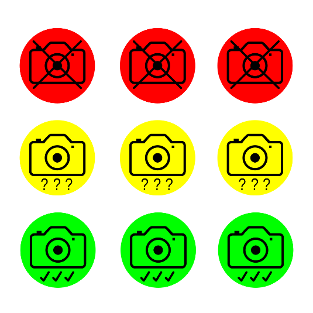
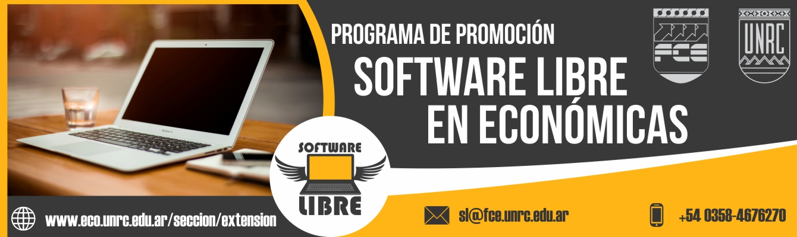
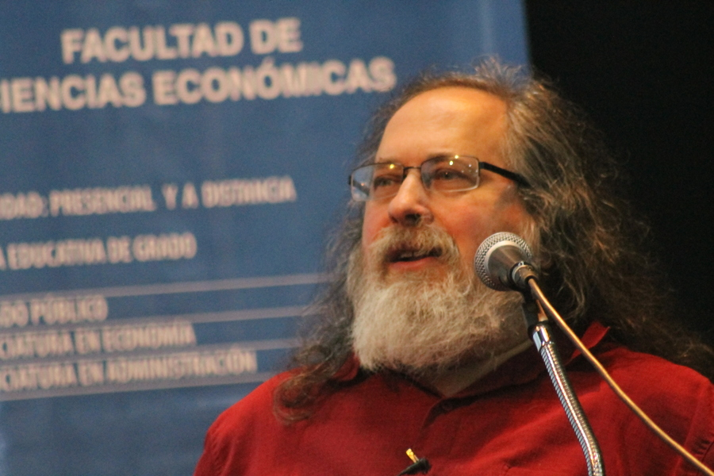
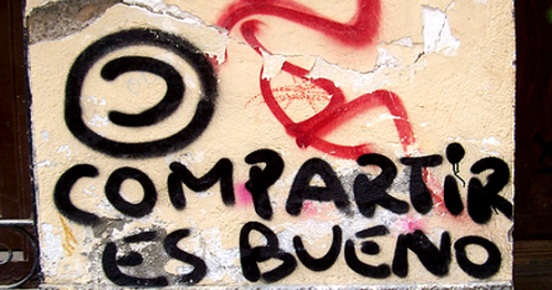
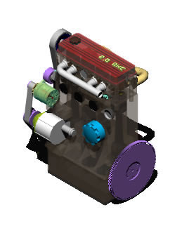
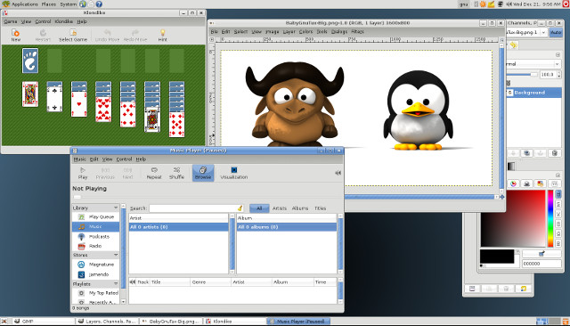
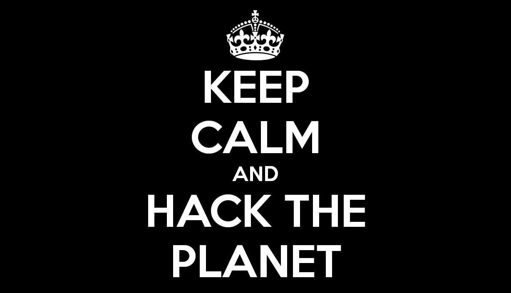

# 

preámbulo

# 

institucional

# 

Secretaría de Extensión y Asistencia Técnica

# parte 1

Conceptos

# ¿Qué es el Software?

# Software Privativo

Software No Libre

# Software Libre

# ¿Qué es el Software Libre?

El Software Libre es aquel que respeta la libertad de las usuarias para ejecutarlo, copiarlo, distribuirlo, estudiarlo, modificarlo y mejorarlo; y la solidaridad social de tu comunidad

# ¿Qué es el movimiento del software libre?

Promueve que las usuarias de computadoras obtengan la libertad que otorga el software libre. El software libre permite que las usuarias ejerzan el control de sus propias tareas de computación

# Richard Stallman

# Libertades

Respeta 4 libertades esenciales

* Ejecutar
* Estudiar
* Copiar
* Modificar

# Ejecutar

# Estudiar

# Copiar

# Modificar

#

No es una distinción técnica sino **ética, social y política**, por lo tanto, más importante que cualquier distinción técnica

# Dependencia vs desarrollo

Usar un programa privativo es **dependencia**

Usar un programa libre es **desarrollo**

# Free Software   Software Libre   (Libre ≠ gratis)

El software libre es una cuestión de **libertad**, no de precio. 
Debe pensarse en «libre» como en «libertad de expresión», 
no como en «cerveza gratis»

# Copyright

#

#

# Copyleft

prohibido girar a la derecha

#

[¿Qué es el copyleft?](https://www.gnu.org/licenses/copyleft.es.html)

# ¿Qué es GNU?

[El manifiesto de GNU](https://www.gnu.org/gnu/manifesto.es.html)

#

GNU es un sistema operativo de Software Libre, 
es decir, respeta la libertad de las usuarias

# Parte 2

¿Qué hace Libre al Software Libre?

# La licencia

# Licencia GPL

# Carácter hereditario

Todo lo que se cree a partir de un programa liberado con GPL tendrá que tener a su vez GPL. Garantiza las 4 libertades esenciales

# Licencias para software

Licencias de Software Libre compatibles con la GPL
[https://www.gnu.org/licenses/license-list.es.html](https://www.gnu.org/licenses/license-list.es.html)

# Parte 3

Programas

# ¿Qué es Linux?

# ¿Qué es GNU/Linux?

# GNU/Linux

# Distribuciones GNU/Linux

# ¿Qué podemos hacer con Software Libre?

# 

# 

# 

# 

# 

# 

# Chasqui

Chasqui es una herramienta multiplataforma de licencia libre que está especialmente diseñada para promover y gestionar la comercialización electrónica de productos de la Economía Social y Solidaria

# Estándares 

Consensuados, Libres y Abiertos vs de facto

Crear un ambiente favorable para que el Software Libre pueda prosperar

# OpenDocument

Formato de Documento Abierto p/ Aplicaciones de Oficina (ODF)

Std OASIS - Open Document Format for Office Applications -

# Parte 4

La Comunidad

# Conocimiento

* Bien Común
* Colectivo

# ¿de quién es el conocimiento?

#

El Software Libre se convirtió en una forma de **producción y distribución del conocimiento** completamente diferente a la que genera la industria capitalista, proponiendo la libertad en el uso y apropiación del conocimiento

#

# Valores y principios

Valores y principios compartidos entre la Economía Social y la producción de Software Libre

# Acceso

El acceso al conocimiento y la tecnología favorece círculos virtuosos de transformación social

# Ética

*"El Software Libre no es un asunto técnico, es un asunto ético del uso de las tecnologías, porque el Software Libre respeta la libertad del usuario y la solidaridad social de su comunidad"* RMS

# Combatir la OBSOLESCENCIA PROGRAMADA

(casi) una distro para cada requerimiento

# 

Comprar, tirar, comprar

# Actualizaciones

# WannaCry

# Tecnología nacional y desarrollo asociado

#

# La familia unida

El conocimiento liberado de patentes, con apoyo del Estado y una academia conectada con las necesidades de la industria, puede facilitar el desarrollo tecnológico local

#

# 

# referencias

videos, entrevistas, libros, notas

#

[El derecho a leer (Richard Stallman)](https://www.gnu.org/philosophy/right-to-read.es.html)

[Software libre para una sociedad libre (RMS)](https://www.gnu.org/philosophy/fsfs/free_software.es.pdf)

[Software Libre y Cultura Libre (por La Imilla Hacker)](https://eldesarmador.org/14-software-libre-y-cultura-libre.html)

[P/12: Tecnología nacional y desarrollo asociado](https://www.pagina12.com.ar/40391-la-familia-unida)

[Códigos Cooperativos](https://youtu.be/sMI1HA9mOmc)

[Video de Richard Stallman para el FLISOL 2009](https://vimeo.com/4152803)

[A qué le llamamos SL, por Beatriz Busaniche](https://youtu.be/h0tXtRRW564)

[En el medio digital: Software Libre. Canal Encuentro](https://youtu.be/NrFbtRV-rOA)

[Manual de tecnologías abiertas para la gestión de organizaciones de la Economía Social y Solidaria](https://www.gcoop.coop/manual-tecnologias-abiertas)

[Chasqui](http://proyectochasqui.org)

#

#

**¡Muchas Gracias!**

